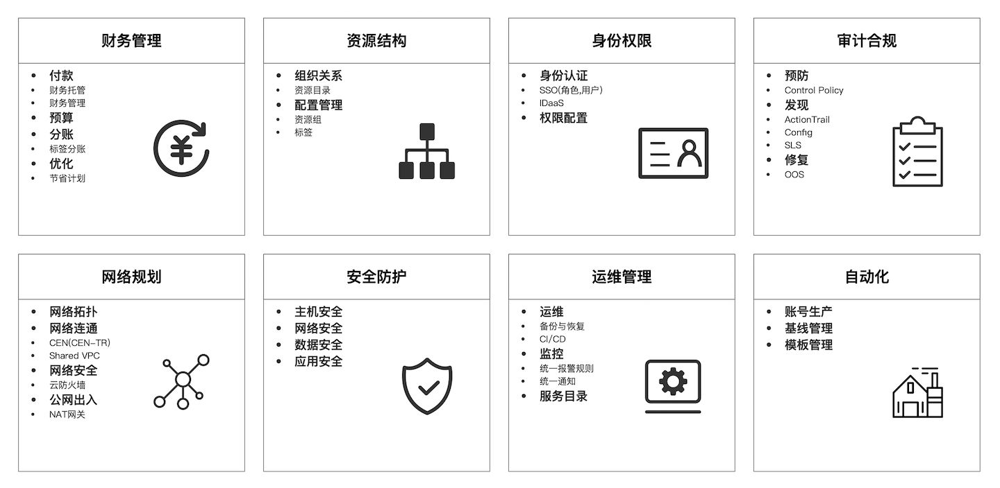
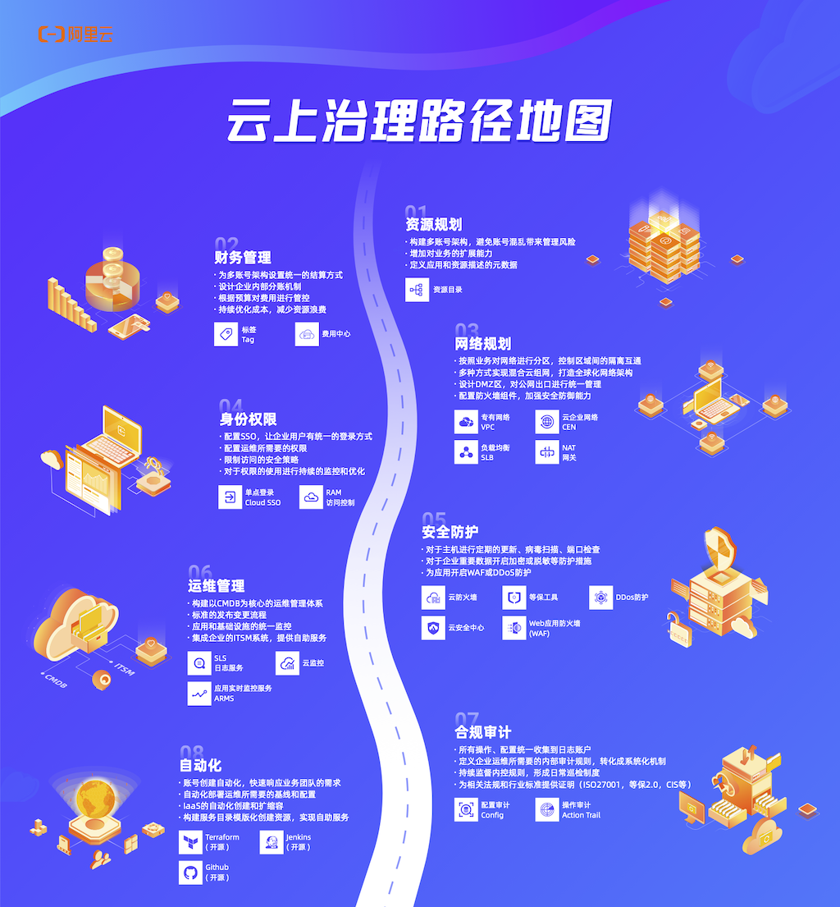

# 阿里云Landing Zone

> Landing Zone是阿里云的企业上云框架，指导企业规划和落地云上资源结构、访问安全、网络架构、安全合规体系，为企业搭建安全、高效、可管理的多账号环境。

## 为什么需要多账号架构？

企业客户构建和部署应用时，他们往往需要某种机制来隔离其资源，这种隔离可以通过多个阿里云账户来实现。一个阿里云账户为您的 云资源提供天然的安全性，访问权限和计费边界，并使您能够实现资源的独立性和隔离性。例如，默认情况下，您帐户以外的用户无权访问您的资源。同样，您消耗的成本按照您的账户分摊。尽管您可能只用一个帐户开始上云之旅，但随着工作负载的大小和复杂性增加，阿里云还是建议您设置多个帐户。使用多帐户环境是一种最佳实践，它具备以下优点：

- **快速创新**：您可以将阿里云账户分配给公司内的创新业务，可以是团队，部门，产品或者应用。独立的帐户为业务的快速创新提供了保障，不用被现有的流程，规则束缚。
- **简化账单**：使用多个阿里云账户可以帮助您确定哪个产品或团队承担的花费，从而简化您的成本分摊。
- **安全控制**：您可以使用多个阿里云账户来隔离具有特定安全要求或必须满足严格合规性要求，例如等保，GDPR或者HIPPA。
- **灵活多变**：您可以将阿里云账户和公司业务流程一一对应，以应对不同业务对运营，法规和预算等方面的特殊要求。

## 客户场景

> 在我们服务的客户中有非常多对多账号有强烈需求的例子，我们从中抽取了一些典型客户场景

1. 某电子消费品客户，随着上云业务增多，通过创建多个阿里云账号，满足业务隔离需求、和不同团队需求。客户除了一个主业务账号，还有社区业务账号、交易业务账号、多个金融业务账号，共计几十个阿里云账号。**由于账号数量的过大，客户的IT运维团队无法统一对这些账号进行管理，在运维时需要频繁的切换登录账号、甚至出现误操作。**通过资源目录，客户快速邀请多个阿里云账号加入企业RD组织，并统一纳管。客户还根据自己的业务情况，按照应用程序、环境、团队或任何其他对业务有意义的业务单元进行账号分组管理，体系化建立树状的组织多账号结构，便于统一管理多账号，支撑未来更复杂的业务需求。
2. 某互联网企业正在进行业务快速的孵化和迭代，为了满足企业快速创新的要求，会为孵化的新业务分配独立的账号，在账号内尝试各类云产品满足业务快速发展的需要，同时实现业务的独立结算，**为业务孵化提供一种快速创新的运维服务管理机制。**
3. 某新金融行业客户，集团旗下子公司开展了包括融资担保、融资咨询、小额贷款等业务的业务；客户近期启动出海计划。由于不同国家的合规要求，企业不同地域的业务需要通过不同合规法规的外审要求，通过多个账号的业务部署，**客户实现了不同地域的审计合规。**由于客户有10+阿里云账号，不管是事中和事后的审计，运维团队都希望在企业管理账号统一设定，而不是逐一在各个云账号中配置。此外，因为业务安全的要求，客户需要为每个云账号都各买一套安全产品。一方面成本很高，另一方面跨账号管理资源的复杂度和人力成本也很高。企业通过资源目录对于多账号进行统一管理，并采用资源目录集成的可信服务，**实现集中安全管控。**

## 多账号带来的挑战

多账号的优势虽然很明显，但是对安全，运维，财务等支持团队都带来了一定的管理挑战.我们举几个例子看一下：

- 财务：
  - 能不能指定一个付款账号,别的账号都通过这个账号付钱
  - 能不能给账号做额度限制,确保不会超过预算
  - 能不能在多个账号间共享折扣,不同账号的消费能否统一开票
- 网络：
  - 多个账号之间的VPC网络能不能打通
  - 能不能做统一公网的出入口
  - 能不能做统一的南北向,东西向的访问控制
- 运维
  - 能不能把多个账号的日志统一收集,统一分析
  - 能不能为多个账号启用一致的管控策略
  - 能不能为多个账号设置统一的监控和报警
- ......

## 如何应对

在这个项目中,我们将会把问题分成8大版块,在每个版块中会总结出若干个典型的场景化解决方案.在每个解决方案中我们会包含几个标准物料:

- 一页解决方案PPT: 包含大图,优势,关联产品
- 一篇说明文档: 详细介绍解决方案原理,以及部署流程
- 一个自动化脚本: 如果有的话,以terraform为主

在这个过程中,我们也会不断地将这些解决方案产品化,对应的产品就是阿里云即将发布的的[云治理中心](https://landingzone.console.aliyun.com)

## 上云路线图

## 功能示例

| Name                                                         | Description                                                  |
| ------------------------------------------------------------ | ------------------------------------------------------------ |
| [01 初始化资源目录](./solution/IAM/function/01-terraform-init-resource-directory) | 为主账号开通资源目录，创建资源夹并在资源夹中创建资源账号     |
| [02 为资源目录下发策略](./solution/IAM/function/02-terraform-control-policy) | 创建新的管控策略，并绑定在指定资源夹下                       |
| [03 为企业成员账号创建角色](./solution/IAM/function/03-terraform-auto-create-role) | 在主账号和旗下所有成员账号中，创建用户指定的RAM角色          |
| [04 用户跨账号扮演角色](./solution/IAM/function/04-terraform-multi-roles) | 主账号扮演用户指定成员账号中的不同角色，并打印出所扮演角色的账号uid |

## 解决方案自动化

| Name                                                         | Description                                                  |
| ------------------------------------------------------------ | ------------------------------------------------------------ |
| [2.1 多账号SSO自动化配置](./solution/IAM/2.1-multi-account-sso) | 为主账号下的成员账号创建用户指定的Idp和RAM角色，实现多账号条件下的SSO |
| [3.1 企业级中心化审计架构](./solution/compliance/3.1-actiontrail) | 该方案指导企业客户在多账号的云上IT架构下，正确稳妥地归集并留存审计日志 |
| [3.2 多账号Golden Image方案](./solution/compliance/3.2-goldenImage) | 基于资源目录实现企业基础镜像的统一构建、共享和分发，保障企业基础镜像的使用合规 |
| [3.3 同步云上配置到企业CMDB](./solution/compliance/3.3-cmdb) | 基于资源目录一站式的采集全量资源配置数据，加快企业自有CMDB的构建 |

## 反馈

如果您遇到任何问题，请提交 Issues；如果您想参与改进项目，请提交 PR。

## 参与开发

提交 PR 时，您需要同意阿里巴巴的 CLA 协议，否则 PR 不会被合并。